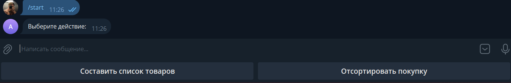
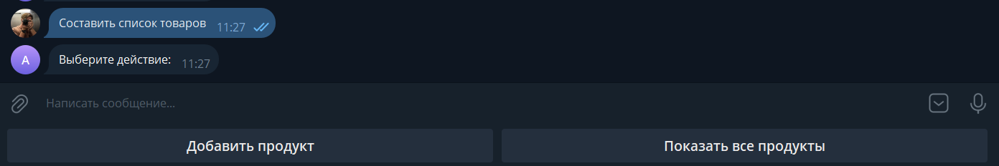
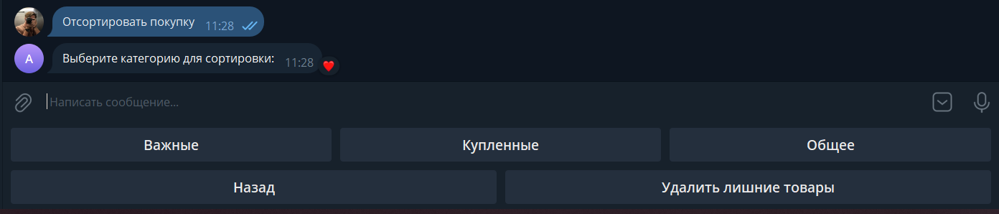
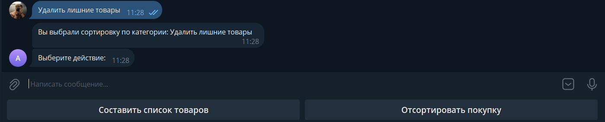
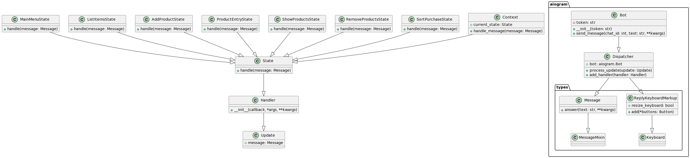

# Бот помощник для шопинга

Бот помощник для шопинга - это Telegram бот, разработанный для того, чтобы помочь пользователям управлять своими списками покупок. Он позволяет пользователям добавлять, просматривать и удалять товары из своего списка, а также сортировать покупки по различным категориям.

## Инструкции по настройке

1. **Клонировать репозиторий:**

    ```bash
    git clone https://github.com/your-username/shopping-assistant-bot.git
    cd shopping-assistant-bot
    ```

2. **Установить зависимости:**

    ```bash
    pip install -r requirements.txt
    ```

3. **Токен бота:**

    - Получите токен Telegram Bot, общаясь с [BotFather](https://t.me/BotFather) в Telegram.
    - Замените `"YOUR_TELEGRAM_BOT_TOKEN"` в коде фактическим токеном бота.

## Как запустить

1. **Установите Python версии 3.11+:** [Скачать Python](https://www.python.org/downloads/)

2. **Откройте командную строку или терминал:**
    - В Windows: Откройте командную строку в данной директории.
    - В Linux/macOS: Откройте терминал в данной директории.

3. **Создайте виртуальное окружение:**
    ```bash
    python -m venv venv
    ```

4. **Активируйте виртуальное окружение:**
    - В Windows:
        ```bash
        .\venv\Scripts\activate
        ```
    - В Linux/macOS:
        ```bash
        source venv/bin/activate
        ```

5. **Установите необходимые пакеты:**
    ```bash
    pip install --force-reinstall -v "aiogram==2.23.1"
    ```

6. **Запустите приложение:**
    ```bash
    python main.py
    ```

## Как работает приложение

1. **Начните чат с ботом в Telegram:**

    

2. **Используйте команды для управления:**

    - `/start` или `/help` - начать чат и получить помощь.

    

3. **Создавайте список и добавляйте продукты:**

    - Выберите "Составить список товаров" и следуйте инструкциям.

    

4. **Сортируйте и управляйте покупками:**

    - Выберите "Отсортировать покупку" и выберите категорию.

    

5. **Просматривайте и удаляйте продукты:**

    - Выберите "Показать все продукты" или "Удалить все продукты".

    

## Функции и использование

### Главное меню
- **Команды:** `/start`, `/help`
- **Действия:**
    - **Создать список покупок:** Инициирует процесс создания списка покупок.
    - **Сортировать покупки:** Позволяет пользователю сортировать покупки по различным категориям.

### Список покупок
#### Создать список покупок
- **Действия:**
    - **Добавить товар:** Добавляет товар в список покупок.
    - **Показать все продукты:** Отображает список всех сохраненных продуктов.

### Сортировка покупок
#### Сортировать покупки
- **Действия:**
    - **Важные:** Сортирует покупки на важные предметы.
    - **Купленные:** Сортирует покупки на купленные предметы.
    - **Общее:** Сортирует покупки по общей категории.
    - **Назад:** Возврат в главное меню.

### Ввод продукта
#### Добавить продукт
- **Действия:**
    - Пользователь вводит название продукта.
    - Товар будет добавлен в список.
    - Пользователь может вернуться в главное меню.

### Показать продукты
#### Показать все продукты
- **Действия:**
    - Отображает список всех сохраненных продуктов.

### Удаление продуктов
#### Удалить все продукты
- **Действия:**
    - Очищает список всех сохраненных товаров.


## Паттерн "Состояние"

В данном проекте использован паттерн проектирования "Состояние" (State), который предоставляет объекту возможность изменять свое поведение в зависимости от внутреннего состояния. Каждое состояние представлено отдельным классом, реализующим общий интерфейс, что обеспечивает единообразие взаимодействия между состояниями.

### Примеры использования паттерна "Состояние" в коде:

#### State (Состояние):

Класс `State` является абстрактным базовым классом для всех конкретных состояний. Он определяет общий интерфейс, через который осуществляется взаимодействие с объектом в различных состояниях.

```python
class State:
    def handle(self, message):
        pass
```
### Concrete States (Конкретные состояния):
Каждый конкретный класс состояния (например, MainMenuState, ListItemsState, AddProductState, и т. д.) наследуется от абстрактного класса State и реализует метод handle, который выполняет конкретные действия для данного состояния.

```python
class MainMenuState(State):
    async def handle(self, message):
        # ... (обработка главного меню)

class ListItemsState(State):
    async def handle(self, message):
        # ... (обработка состояния списка товаров)

# Другие конкретные состояния аналогичны...
```
### Context (Контекст):
В контексте, представленном в вашем боте или его отдельной части, происходит управление переходами между состояниями.

```python
class AddProductState(State):
    async def handle(self, message):
        # ... (обработка добавления продукта)
        global current_state
        current_state = ProductEntryState()

```
### Transition between States (Переход между состояниями):
В различных обработчиках сообщений (например, при вводе названия продукта) происходит переключение состояний с использованием глобальной переменной current_state.

```python
class ProductEntryState(State):
    async def handle(self, message):
        # ... (обработка ввода названия продукта)
        global current_state
        current_state = MainMenuState()
        await current_state.handle(message)
```

### Преимущества использования паттерна "Состояние":
Паттерн "Состояние" делает код более структурированным, облегчает добавление новых состояний и позволяет изменять поведение системы без изменения ее общей структуры. В результате код становится более поддерживаемым, гибким и расширяемым.

## UML - диаграмма
 

## Примечания

- Бот использует библиотеку `aiogram` для разработки Telegram бота.
- Состояния используются для управления различными состояниями бота, обеспечивая чистый и организованный рабочий процесс.
- Пользовательский ввод обрабатывается с помощью ряда команд и интерактивных меню.
