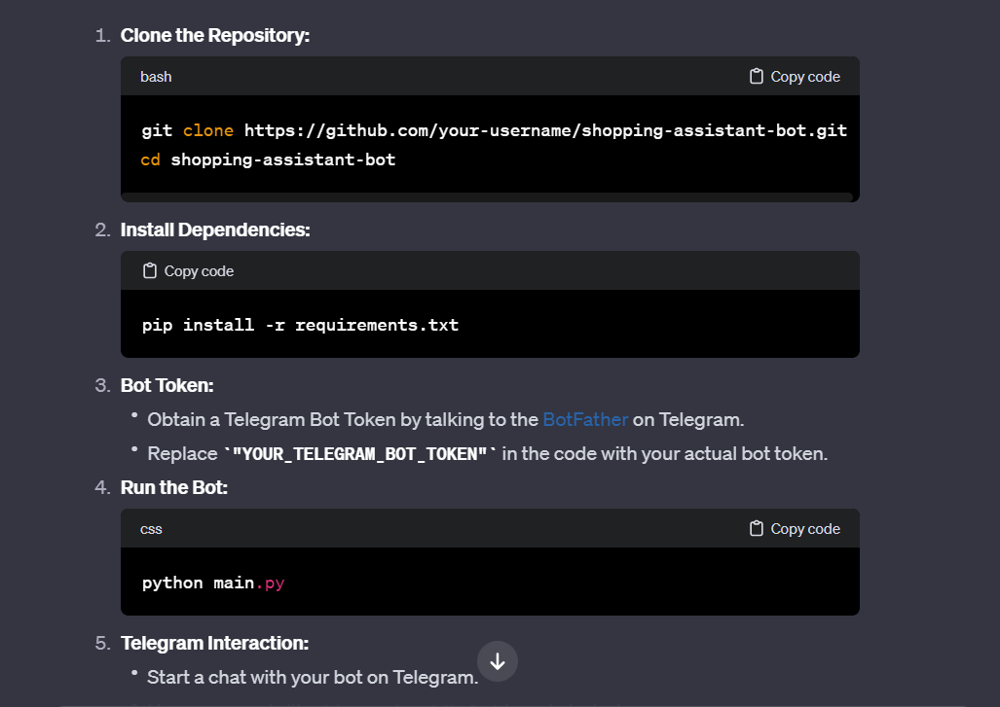
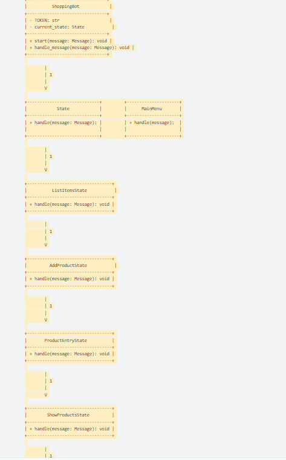

Обзор проекта
Shopping Assistant Bot — это бот Telegram, разработанный, чтобы помочь пользователям управлять своими списками покупок. Оно позволяет пользователям добавлять, просматривать и удалять товары из своего списка, а также сортировать покупки по различным категориям.

Инструкции по настройке
Клонируем репозиторий:

бить
Скопировать код
git clone https://github.com/your-username/shopping-assistant-bot.git
CD-бот-помощник по покупкам
Установите зависимости:

Скопировать код
pip install -r требования.txt
Токен бота:

Получите токен Telegram Bot, поговорив с BotFather в Telegram.
Замените «YOUR_TELEGRAM_BOT_TOKEN» в коде фактическим токеном бота.
Запустите бота:

CSS
Скопировать код
основной файл Python
Взаимодействие в Телеграмме:

Начните переписку со своим ботом в Telegram.
Чтобы начать работу, используйте такие команды, как /start или /help.
Перемещайтесь по предоставленным опциям для управления списком покупок.
Особенности и использование
Главное меню
Команды: /start, /help
Действия:
Составить список товаров: Инициирует процесс создания списка покупок.
Отсортировать покупки: позволяет пользователю сортировать покупки по различным категориям.
Список покупок
Составить список товаров
Действия:
Добавить товар: добавляет товар в список покупок.
Показать все продукты: Отображает список всех сохраненных продуктов.
Сортировка покупок
Отсортировать покупку
Действия:
Важные: Сортирует покупки на важные предметы.
Купленные: Сортирует покупки на покупные.
Общее: сортирует покупки по общей категории.
Назад: Возврат в главное меню.
Ввод продукта
Добавить продукт
Действия:
Пользователь вводит название продукта.
Товар будет добавлен в список.
Пользователь может вернуться в главное меню.
Просмотр продуктов
Показать все продукты
Действия:
Отображает список всех сохраненных продуктов.
Удаление продуктов
Удалить все продукты
Действия:
Очищает список всех сохраненных товаров.
Примечания
Бот использует библиотеку aiogram для разработки бота Telegram.
Шаблоны состояний используются для управления различными состояниями бота, обеспечивая чистый и организованный рабочий процесс.
Пользовательский ввод обрабатывается с помощью ряда команд и интерактивных меню.
Бот предоставляет пользователям обратную связь в режиме реального времени на основе их действий.
Пользователи могут перемещаться между различными состояниями, используя предоставленные параметры.
Проект является модульным и расширяемым для будущих улучшений.
Не стесняйтесь настраивать и расширять функциональность бота в соответствии с вашими конкретными требованиями.

